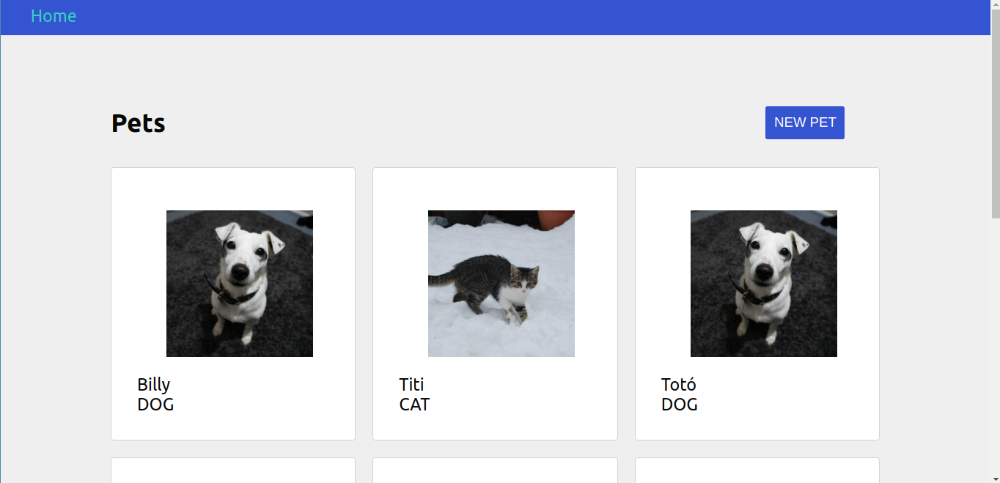
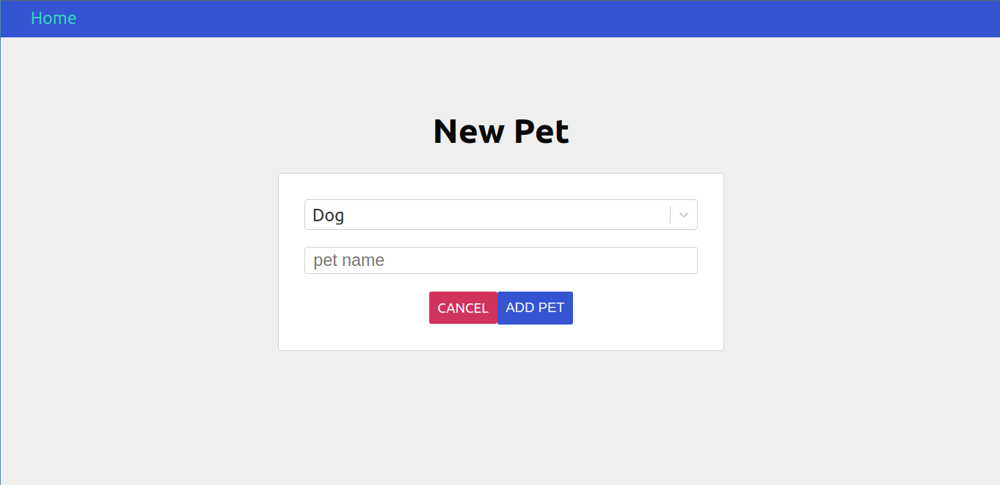
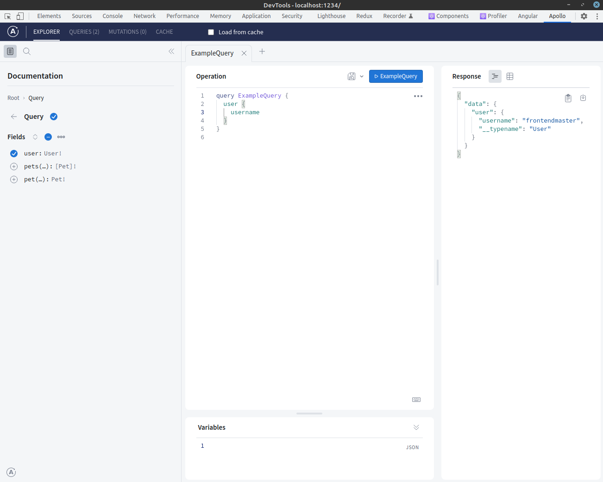

# Fullstack GraphQL

> Learn how to use GraphQL with Node and React

This course comes with some [slides](https://docs.google.com/presentation/d/1IrGA4PtUEZPVDTBg5_WCMmUapElbFBgLwfSBAp8ft1g/edit?usp=sharing).

## Playground

An introductory playground can be found [here](http://rickandmortyapi.com/graphql).

## Tools

- [Apollo Client Devtools](https://chrome.google.com/webstore/detail/apollo-client-devtools/jdkknkkbebbapilgoeccciglkfbmbnfm/related?hl=en-US) (Chrome Extension)

## What you'll need

- Node version >= 6

## Solutions

The solution branch has the completed course fo reference. There is no one way to finish this course.

`git checkout solution`

## Previews

### Home

### Add Pet

### Apollo Devtools

