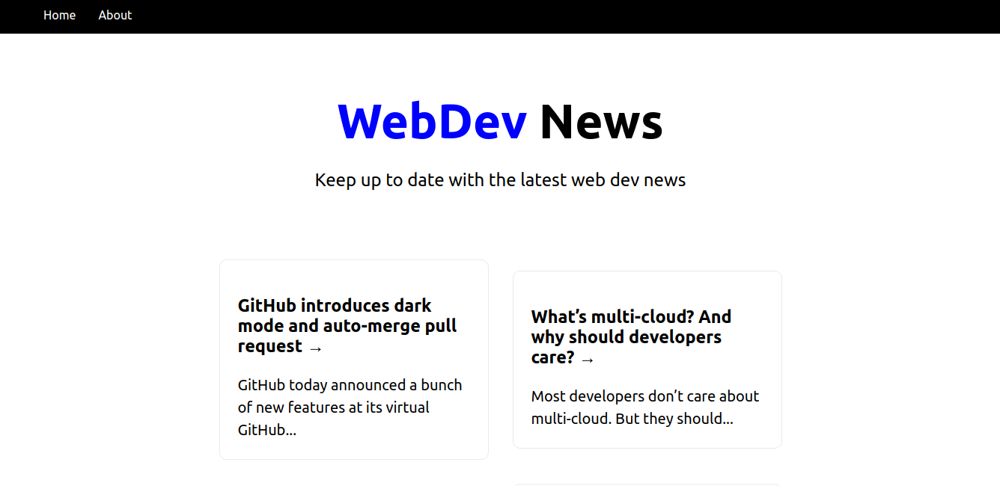

# Next.js Crash Course

## About

### What should know JavaScript as well as the basis of React including the following:

- Creating components
- Using JSX
- Passing props
- Using state

### What is Next.js?

Next.js is a React front-end development web framework created by Vercel (formerly Zeit) that enables functionality such as server-side rendering and static site generation.

### Server-side Rendering

Unlike a traditional React app where the entire application is loaded and rendered on the client, Next.js allows the first page load to be rendered by the server, which is great for SEO and performance.

### Other Next.js Benefits

- Easy page routing
- API Routes
- Out of the box TypeScript & Sass
- Static site generation (next export)
- Easy deployment

## Hands-on

- Creating a new project: `yarn create next-app my-app-name`
- For running the result after `yarn run build`, which is the short version of `next build && next export`:
- Install _serve_ globally: `sudo npm i -g serve`
- Run: `serve -s out -p 8000`

## Preview

